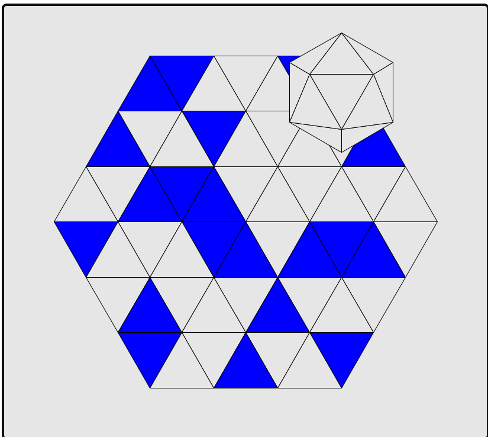
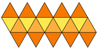

# Topic Research -- Cube  

Author: B11901015 黃思維

## Reference

Origional Game: [Simon Tatham's Portable Puzzle Collection](https://www.chiark.greenend.org.uk/~sgtatham/puzzles/js/cube.html)  

Implementation Triangular Grid: [Triangular Grid](https://www.redblobgames.com/grids/parts/)  

Icosahedron:  

## Modeling

### Triangular Grid  

Follow above implementation.  

Direction bit: 0 is flat top(left), 1 is pointy top(right).  
Size: 6x6x2(direction bit), however only triangle with sum of (x, y, b) in [3,8] is valid.  

### Icosahedron  

With the above Expand diagram, we order edge in CW.  
For flat top, top edge is 0, right edge is 1, left edge is 2.  
For pointy top, bottom edge is 0, left edge is 1, right edge is 2.  

With the edge order, we store the adjacent face of each edge.  

We name each face with (x,y) axis.  

Ex. for face (0,0), its adjacent face is [(0,1),(0,4),(0,1)]

We also memory the current state of icosaedron by storing the current face at the bottom and the current edge at the top or the bottom.  

### State transition

Choose from 3 directions.  
If the direction is invalid, the state will not change.  
After moving, switch the color of the current face and the current board block.

### Goal

Each face of the icosaedron has a color.  

## Transition to circuit  

54 bits to store the board.  
20 bits to store the color of icosaedron.  
2 bits to store the current direction.  
6 bits (3 bits for x, 3 bits for y) to store the current face.

## Generate the board

reference to data_gen.py  